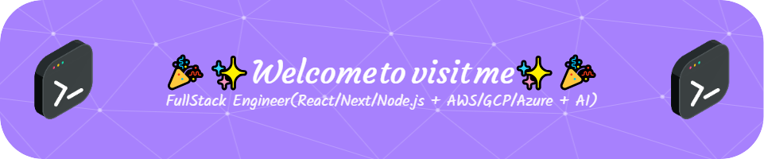

  

  

-   👯 I’m looking to collaborate on **Great & innovative ✨Shiny✨ Project!!!**

-   🤝 I’m looking for help with **All kind of fantastic projects**

-   🌱 I’m FullStack Engineer **specialized in FronEnd development**, am experienced **4years** of **AI - Lang Chain & Machine Learning** and **9years** of **React/Next/Node.js & AWS**
<!-- -   👨‍💻 All of my projects are available at [RS1117_portfolio.io](https://app.enhancv.com/share/e9ecfbdc/?utm_medium=growth&utm_campaign=share-resume&utm_source=dynamic)-->

-   💬 Ask me about **React/Next & AWS anything I can help you!**

-   📫 How to reach me **remarkable.sr1117@gmail.com**

-   ⚡ Coding is my whole life!!! <<---ADIDAC--->> **💖🔥⚡🎇🧨💎All Day I Dream About Coding💋⚽🍔🍻✈💤**

<h3 align="left">Connect with me:</h3>

    

<h3 align="left">🛠 Language and tools</h3>

  
  
  
  
  
  
  
  
  
  
  
  
  
  
  
  
  
  
  
  
  
  
  
  
  
  
  
  
  
  
  
  
  
  
  
  
  
  
  
  
  
  
  
  
  
  
  
  
  
  
  
  
  
  
  
  
  
  
  
  
  
  
  
  
  
  
  
  
  
  
  
  
  
  
  
  
  
  
  
  
  
  
  
  
  
  
  
  
  
  
  
  
  
  
  
  
  

 

### E-Commerce & Online Shoping Website

   

  ### Fantastic Website and Mobile application & dynamic dashboard design

   

  ### Video Conference Web & Mobile application

   
    
  ### SaaS/CRM/CMS Web & Mobile application
    
   

  ### Crypto Trading Platforms & Bots

   

  ### AI-powered chatbot using ChatGPT API and LangChain

   
  
  ### AWS Services, Cloudfront, SSL Setup

   

<h3 align="left">🔥   My Stats :</h3>

###

  

###

  
  

###
